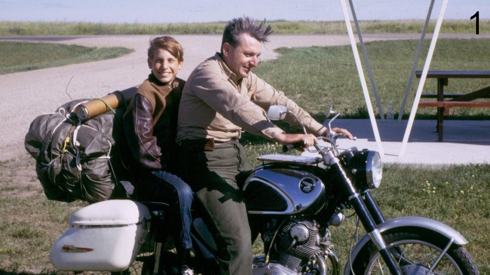

# Zen i umjetnost održavanja motocikla (1. dio)

---

Peripatetička je škola naziv za neformalna okupljanja starogrčkih filozofa – ljubitelja Istine – pod Aristotelovim tutorstvom. Na neki je način svaka osoba odrasla na Zapadu nakon Prosvjetiteljstva Aristotelov sljedbenik utoliko što je neoaristotelizam poslužio kao katalizator (tehnološkog) razvoja modernog zapadnjačkog društva. Karakteristika današnjeg _zeitgeista_ je cinizam u odnosu na budućnost, humanističke vrijednosti i moralni apsolutizam. 

Kako je do toga došlo?

<!-- more -->

Pokušaj odgovora na ovo pitanje, koji nudi knjiga "Zen i umjetnost održavanja motocikla" autora R. M. Pirsiga, podesan je kao jedna od prvih objava našeg bloga, i prva od, nadamo se, mnogih bukrivjuova [#PišiKakoČitaš](https://hr.wikipedia.org/wiki/Johann_Christoph_Adelung).
 __Ako vas zanima filozofski aspekt knjige, ali ju nemate vremena pročitati, ovo je rivju za vas! Svako je poglavlje sažeto na par rečenica ključnih ideja.__ U narednim ću stranicama iznijeti detaljan sažetak knjige po poglavljima sa fokusom na filozofski aspekt. Moja je želja, uz digitalizaciju vlastitog dnevnika čitanja, iznošenje autorove filozofije sa svim neophodnim koracima. Cilj je svesti knjigu od 400 strana na 10ak minuta čitanja.

Za one koji ipak požele pročitati knjigu, tekst koji slijedi, iako detaljan, nije sveobuhvatan. Naime, u ovoj se knjizi isprepliću dvije knjige, a ja namjerno izostavljam onu putopisnu, emocionalnu. Ona predstavlja dramatizaciju intelektualnog putovanja, i njeno bi sažimanje uništilo vrijednost doživljaja iste: ovaj ćemo motiv ponovo sresti. :sunglasses: 

---

## 1. dio: Fenomenologija racionalnosti

### TL;DR - Sažetak 1. dijela

Započinjemo putovanje. Razmatrajući odnose različitih ljudi prema tehnologiji, pronalazimo da iz različitih sustava vrijednosti proizlaze različite vizije stvarnosti - "romantična" i "klasična". Klasična je dominantna moderna vizija stvarnosti. Manifestira se u obliku tehnologije i znanosti, a temelji se na racionalnosti. No, lišena osobnog značaja, beskompromisna racionalnost vodi ka dehumanizaciji. Povrh toga, sama je racionalnost, zasnovana na iracionalnim pretpostavkama, iracionalna i kao takva samu sebe proždire.

---

### Poglavlje 1 - Početak putovanja

Opisuje se poanta knjige. Autor nagoviješta ono šta ćemo vidjeti kasnije. Na primjer, u jednom trenutku opisuje kako se na putovanjima kroz Srednji Zapad motociklom uglavnom snalazi "by dead reckoning, and deduction from what clue we find". Ovo postaje bitno kasnije.
Autor uvodi koncept [__Chautauque__](https://en.wikipedia.org/wiki/Chautauqua) - društveno-edukativnih skupstina čija je popularnost u Sjevernoj Americi dosegla vrhunac na prelasku sa 19. na 20. stoljeće, a čija je svrha bila usmeno poučavanje široke publike kulturi govorima, glazbom i predstavama. 
Poglavlje počinje mizanscenom: autor, njegov sin i bračni par prijatelja motociklima putuju Sjevernom Amerikom. Autor se od to dvoje prijatelja razilazi u pogledu pristupa održavanju motocikala. Dok autor smatra da se time valja baviti osobno, prijatelj (muž) smatra da posao treba prepustiti iskusnim mehaničarima. Ispada da se problem prostire onkraj održavanja motocikala. Naime, autor postupno shvaća kako se radi o temeljnom razilaženju u pristupu tehnologiji i shvaćanju iste. Prijatelji imaju ono šta autor naziva "romantičnim" pogledom, pa im tehnika i strojevi predstavljaju ono šta, površno gledano, i jesu: zbunjujuće i komplicirane hrpe metala, plastike i gume čija je jedina svrha linearno obavljanje određenog posla, a čija je kolateralna žrtva kreativnost. 
Autor (pomalo samozadovoljno, ako mene pitate) govori kako on tehnologiju shvaća u obliku "temeljne forme", te da strojeve vidi kao realizacije ideja.

>"_Ja se s njima ne slažem u održavanju motocikla, ali ne zato što nemam razumijevanja za njihove osjećaje kad se radi o tehnici. [...] njihov bijeg od tehnike i mržnja prema njoj sami sebe poražavaju. Jer Buda, Glava Božja, jednako ugodno prebiva u tokovima digitalnog kompjutora ili zupčanicima prijenosa nekog motocikla kao što prebiva na vrhu planine ili laticama nekog cvijeta. Misliti drugačije znači omalovažavati Budu — što znači omalovažavati samog sebe. Eto o tome želim govoriti u ovoj chautauqui..._"

### Poglavlje 2: O sudjelovanju, pažnji i brizi

Autor Chautauquu započinje anegdotalno, sa namjerom izlaganja ispravnog načina pristupanja problemu knjige. 
Prva anegdota: pri jednom od putovanja sa sinom motor ga izdaje usred puta. Autor se upušta u špekulacije kako bi shvatio u čemu je problem, smišlja razne hipoteze, jednu kompliciraniju od druge, no ne uspijeva pronaći razlog kvaru. Ispostavlja se kako je jednostavno rezervoar bio prazan! Problem nije bio kompleksan, ali ga je autor previdio jer _nije obratio pozornost_ gdje je trebalo.
Druga anegdota: autor prepričava svoja iskustva sa mehaničarima, svim odreda lošim. U više je navrata išao kako bi popravio motor. Svaki bi put dijagnosticirali problem nabrzaka, ovlaš, i svaki bi put bili u krivu. Kada bi napokon pronašli uzrok problema, _nemarno bi pristupili_ popravku, požurujući ga, šta je često dovodilo do veće štete.
Autor zaključuje poglavlje izražavanjem namjere da materiji knjige pristupi polako, na tenane, pažljivo i posvećeno, kako mu ništa od velike važnosti ne bi promaklo:

>"_Kad želite nešto požuriti, to znači da vam nije više stalo do toga i da želite prijeći na druge stvari._"

### Poglavlje 3: Priče o duhovima: Čovjek, znanost i vjera

Autor izlaze svoje misli vezane za znanost, znanstvenu paradigmu i zakone prirode kao entitete koje je formirao i formalizirao Čovjek.
Vjera u duhove je svojstvena modernim, kao i nekoć predmodernim, ljudima, no iz zatočeništva vlastite kulturne paradigme te aveti djeluju stvarno. Sa stajališta predmoderne paradigme Duša djeluje stvarno, a zakon gravitacije kao duh, izmišljotina. Autor argumentira kako Newtonov zakon gravitacije ne postoji doli u ljudskoj mašti, u post-Newtonovskom umu. Zakone prirode su, kaže, izmislili ljudi. Oni su ostatci duhova Sokrata, Platona, Aristotela, Newtona, Descartesa i sličnih.
Dva planeta ne poštuju "zakon gravitacije". Dva planeta postoje i ponašaju se kako se ponašaju. Ljudi određeno svojstvo njihovog postojanja nazivaju "međusobnim privlačenjem" i zbog njegove ga postojanosti nazivaju "zakonom".

### Poglavlje 4: Osobnost kao posljedica odnosa

Govori se o tome kako stvari (i ideje) poprimaju narav s obzirom na odnos koji sa njima imamo. Autor govori o starom paru rukavica koje dugo vremena posjeduje i koje su mu veoma drage, te motor. Prolazak vremena, ljudska (ne)briga o stvarima i događaji prožimaju stvari u našem vlasništvu osobnošću.

>"_To biste možda mogli nazvati naravi. Svaki stroj ima svoju jedinstvenu narav koja bi se vjerojatno mogla definirati kao intuitivni zbroj svega što znate i osjećate o njemu. ... Ta se narav neprekidno mijenja, obično na gore, ali ponekad neočekivano na bolje, i ta narav je stvarni predmet održavanja motocikla._"

Ta osobnost ne postoji u vakuumu, već samo u odnosu na ljude. Ona je humanistički koncept, i postoji samo u humanističkoj paradigmi.

__Komentar:__ Isto je i sa ljudima, roditeljima, prijateljima i romantičnim partnerima. Način na koji se prema njima odnosimo modulira njihovu urođenu osobnost, i ta se modulirana verzija njihove osobnosti ispoljava u interakcijama i utječe na nas. 

### Poglavlje 5: Vizije stvarnosti

Zalazi se dublje u problematiku Chautauque - ljudskom odnosu prema tehnologiji i tehnološkom odnosu prema ljudima. Autor polazi od razilaženja sa prijateljem oko brige o motorima.
Prijatelj (muž) ima problem za koji autor predlaže rješenje u obliku komada limenke piva. Naime, za rješenje tog konkretog problema potreban je tanki, duguljasti, plosnati komadić lima koji bi se mogao ugurati između 2 metalne površine kako bi ih otpustio. Prijatelj se suprotstavlja ideji da vlastiti motor podvrgne popravku komadićima limenki piva.
Autor se pita otkuda taj otpor ako taj komadić lima može poslužiti kao optimalno rješenje.
Problem je u različitim vizijama stvarnosti.
Prijatelj promatra problem sa stanovišta direktnog utiska, emocije, osjećaja.
Autor isti problem promatra sa stanovišta "temeljne forme", odnosno funkcionalnosti u ovom slučaju.
Prvi je "romantičan", drugi je "klasičan".
Prijatelj je metalnu površinu limenke promatrao iz perspektive šta je ona _značila_, dok ju je autor posmatrao iz perspektive šta je ona _bila_. Drugim riječima, prvi je vidio neposrednu pojavu limenke pive: komad jeftinog lima koji nakon popijene pive nije bio nizašta nego za u smeće, a pogotovo ne ya popravak skupocjenog motocikla! Autor je, s druge strane, vidio onkraj toga potencijalnu funkciju komada lima s obzirom na njegove atribute.
Krajem poglavlja se spominje Phaedrus - duh iz prošlosti...

__Komentar:__ Pokušao sam šta točnije prevesti terminologiju koju je autor upotrijebio. Osobno se ne slažem previše sa načinom izlaganja. Prijatelja se predstavlja kao pomalo površnog praznoglavca nesposobnog za "primjećivanje onoga sta se nalazi ispod površine", a sebe kao dubokog i dalekosežnog tehnologa.

### Poglavlje 6: Temeljna forma i neposredni utisak

Opisuje se figura Phaedrusa, te se objašnjava njegova veza sa trenutnim problemom. Izgleda kao da autor ne iznosi vlastite misli, vec Phaedrusove. Zasada je Phaedrusova veza sa autorom nepoznata.
Razrađuju se koncepti temeljne forme i neposrednog utiska spomenuti u prijašnjem poglavlju. Tako prvi postaje specifični primjer _klasičnog_ pogleda na svijet, a drugi primjer _romantičnog_.
_Klasični_ je racionalan, promišljen, analitičan, hladan, organiziran, proračunat, te obuhvaća tehnologiju, tehniku, znanost, matematiku, logiku i racionalnost.
_Romantični_ ima veze sa estetikom, ljepotom, doživljajem, instinktom i emocijom, često sa iracionalnošću, a obuhvaća umjetnost i sve šta nije podložno ili se opire racionalnosti.
Phaedrus je bio stručnjak za klasično razmišljanje i autor želi proučiti njegov uzorak razmišljanja, _analizirati samu analizu_. Uzima motor kao primjer hijerarhije koncepata koja tvori temelj racionalnog razmišljanja.
Problem: ta je hijerarhija neosobna, ili se barem takvom čini i predstavlja. Znanosti i tehnologija često (čitaj: u pravilu) izostavljaju upravo ono čemu bi trebale služiti: Čovjeka. Tu govorimo o značenju "tehnološkog pogleda na Čovjeka."

Valja napomenuti kako, iako sebe prikazuje kao pobornika klasičnog načina razmišljanja u odnosu na svog "romantičnog" prijatelja, autor ne predstavlja romantični aspekt kao inferiornim u odnosu na klasični. Dapače, za glavninu problema okrivljuje klasični pogled na svijet. Moram reći da je to osvježavajuća promjena u odnosu na mnoge "pobornike racionalnosti".

Autor opisuje: romantičnom umu klasični način razmišljanja djeluje mrtvo, beživotno, rigidno, nemilosrdno, hladno i nehumano, dok s druge strane romantični način klasičaru izgleda neorganizirano, proizvoljno, divlje, puteno, površno i hirovito. Ne mogu shvatiti jedan drugoga jer se međusobno promatraju iz okrilja različitih paradigmi i ocjenjuju drugoga po kriterijima okomitima njegovim težnjama i idealima. Klasičaru estetska privlačnost nije prioritetna, pa čak ni poželjna, već eventualno slučajna posljedica. Na sličan način romantičaru nisu prioritetne efikasnost i sistematičnost.

### Poglavlje 7: Analiza, klasifikacija, racionalnost

Autorov je prijašnji ego, Phaedrus, bio analitičar, filozof, klasični mislioc. Njegov je cilj bio analizirati samu analizu, analizirati racionalnost za koju na kraju uviđa kako se i sama temelji na iracionalnim pretpostavkama.
Racionalnost naziva _aveću_, kao ranije zakon gravitacije:

>"_To je utvara normalne svakidašnje pretpostavke koja tvrdi da konačna svrha života, to jest održavanje na životu, nije moguća, ali da je to ipak konačna njegova svrha, tako da se veliki umovi očajno bore da liječe bolesti da bi ljudi dulje živjeli, a samo luđaci pitaju zašto. Čovjek dulje živi da bi dulje živio. Druge svrhe nema. To kaže ta utvara._"

Racionalnost, pomnije promatrana, brzo otkriva unutarnje proturječnosti i nedosljednosti.

Govori se i o samom Pheadrusu: iznimno inteligentnoj ličnosti, samotnjaku, beosjećajnom analitičaru. Bila je to osoba koja je išla onkraj granica znanog, u potrazi za Istinom, cak i nauštrb same sebe.
Phaedrus je umro - uklonjen [Elektrokonvulzivnom terapijom](https://en.wikipedia.org/wiki/Electroconvulsive_therapy).
Ostao je samo autor.

---

Izvor naslovne slike: [bfcarlson.com](https://www.bfcarlson.com/p/3-12-lessons-from-zen-and-the-art)
