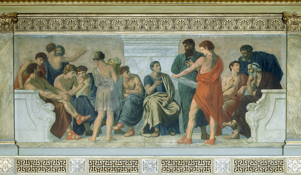

# Zašto *Peripatetika*?

{ .image-hero }

[Peripatetička škola](https://hr.wikipedia.org/wiki/Peripateti%C4%8Dka_%C5%A1kola) je naziv za neformalna okupljanja starogrčkih filozofa Aristotelovog doba. Svrha tih okupljanja, otvorenih ljudima svih kasti i pozadina, bila je poučavanje i slobodno proučavanje filozofskih i znanstvenih teorija.

<!-- more -->

Etimologija naziva škole povezuje i naglašava mjesto i metodu predavanja. S jedne strane, "predavanja" su se, zbog Aristotelove navodne sklonosti da predaje u hodu, odvijala u [Liceju](https://hr.wikipedia.org/wiki/Licej) omeđenom kolonadama (grč. $\pi \varepsilon\rho\acute{\iota}\pi\alpha\tau\omicron\iota$, hrv. _kolonade_) i  na atenskim šetnicama. Jedna od njih nosi naziv Peripatos (grč. $\Pi \varepsilon\rho\acute{\iota}\pi\alpha\tau\omicron\varsigma$, hrv. _šetnica_). S druge strane, metodologija tih predavanja je često zrcalila njihov fizički aspekt pa su ona sama nalikovala na intelektualna vrludanja u potrazi za shvaćanjem.

## Tko su bili peripatetici?

Peripatetička su predavanja često poprimala formu dijaloga tokom kojih su preispitivana uvjerenja i naizgled etablirane činjenice, kategorizirani fenomeni, ostvarivani zaključci. Usto su rast i razvoj ideja bili pospješeni i formatom peripatetičke metode.  Naime, zamijenivši statična predavanja sa pijedestala za dinamična predavanja u hodu te uklonivši tako rigidnu strukturu predavač-učenik, olakšana je dijalektička izmjena ideja.

Pokušaji građenja vlastitih argumenata i objašnjenja svijeta počinjući od očitih, konkretnih, općeprihvaćenih koncepata (tzv. [endoxa](https://www.definitions.net/definition/endoxa)) uzemljavali su peripatetike i, uz njihovu naklonost kategoriziranju, dovodili su do novih struktura znanja čija je vjerodostojnost bila mjerena, umjesto stupnjem poštovanja dogmi, time koliko je novootkriveno znanje njima i ljudima oko njih bilo smisleno. Pritom je svaki _endoxon_ bio podložan promjenama ili, rjeđe, čak odbacivanju ukoliko je razvoj misli to zahtijevao.

U tom smislu o njima možemo razmišljati kao o "*filozofima lutalicama*".

<figure class="image-inline">
  
   <figcaption class="image-credit">
   Šetnica <em>Peripatos</em>. Izvor: 
   <a href="https://upload.wikimedia.org/wikipedia/commons/thumb/b/b2/Peripatos_Acropolis_Athens.jpg/1280px-Peripatos_Acropolis_Athens.jpg" target="_blank" rel="noopener">
      Wikimedia Commons
   </a>
   </figcaption>
</figure>

## Metoda bloga Peripatetika

Blog smo nazvali Peripatetika zato jer nam se svidjela misao o razvijanju koncepcije svijeta vrludanjem prostranstvima ideja inzistirajući ponajprije na smislenošću i uzemljenosti početnih i završnih pozicija. Poanta nije subverzija ni tradicija ni modernih viđenja, već njihova sofistikacija kako bi se pronašao način da ih se pomiri i sintetizira u točkama trenja ili naizgledne oprečnosti. Smatramo kako se do toga može doći odvajanjem žita od kukolja, ali uvijek samorefleksivno imajući na umu koje kriterije upotrebljavamo kako bi nešto nazvali žitom a nešto kukoljem.

To u praksi znači da na ovom blogu nećemo nužno u startu znati odgovore na naša pitanja, a iskreno, često najvjerojatnije nećemo znati ni pitanje. I prvo i potonje ćemo vjerojatno iskopavati iz hrpe početnih premisa i hipoteza, šta naših, šta tuđih. Samim time možete očekivati nedorečene objave, objave koje završavaju pitanjem ili objave koje opovrgavaju prijašnje s obzirom kako se naše nedovršene misli budu razvijale.

## Vrsta sadržaja bloga

Očito, budući da živimo sada a ne u nekom drugom vremenu, naša će perspektiva biti ona "modernog čovjeka". Kao i svih, i nas zanimaju odgovori na pitanja koje se Čovjek uvijek pitao: "Kako funkcionira svijet?", "Kako svijet uklopiti u vlastiti život i kako život uskladiti sa ostatkom svijeta?" i naravno, najbitnije: "Zašto?". Odgovore na ta veoma općenita pitanja pokušavaju dati znanost, filozofija i religija. O znanosti znamo nešto malo, o filozofiji nešto manje, a o religiji gotovo ništa. 

Ali to nas neće spriječiti da ipak kažemo barem nešto!

---

<small>
Izvor naslovne slike: Gustav Adolph Spangenberg, "*Aristotelova škola*"; [kunstkopie.de](https://www.kunstkopie.de/kunst/gustav_adolph_spangenberg/Schule-des-Aristoteles-1.jpg)
</small>

---