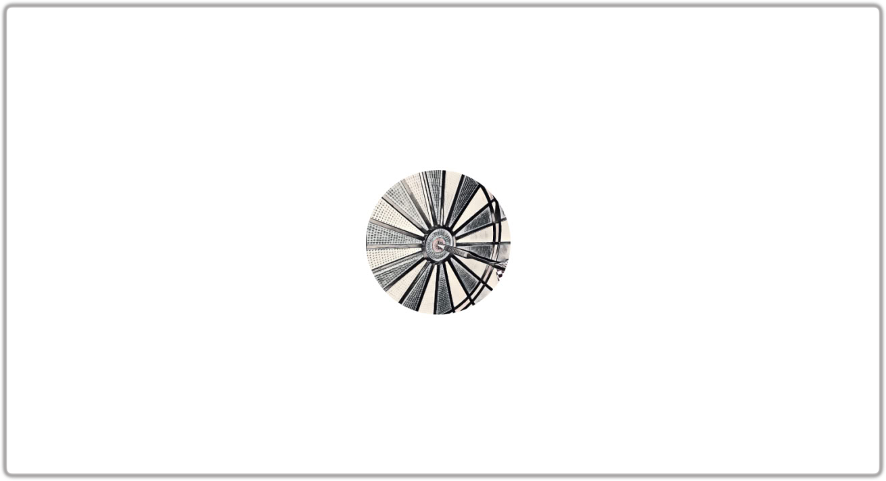

# Dobrodošli na blog Peripatetika!

> _Nihil est in intellectu quod non sit prius in sensu._
> 
> Ništa nije u umu što prethodno nije bilo u čulima.
> 
> ~ Toma Akvinski, _De veritate_

<!-- more -->

### Zašto?

Ovaj smo blog započeli s namjerom vođenja zapisa o našim razgovorima. Sigurno znate onaj osjećaj kada, nakon višesatnog razgovora s nekime, kažete sebi kako ćete se sigurno sjetiti glavnih zaključaka, samo da biste nakon par dana shvatili da vam je maltene sve isparilo. Ovaj je naš pokušaj da tome doskočimo. 

### Za koga?

Ako uživate u stvaranju neočekivanih poveznica između naizgled dalekih ideja/tema ili ako ste ikad priskuškivali razgovor dvoje stranaca u pubu (slučajno, naravno :wink:) i načuli nešto neočekivano šta vas je potaklo na razmišljanje, ovo je blog za vas.

### O čemu?

Ovdje namjeravamo istraživati ideje, preispitivati dogme i nastojati shvatiti teme koje smatramo bitnima: od ekonomije, preko znanosti i filozofije, do religije i duhovnosti. Ono što je svima njima zajedničko je, s jedne strane činjenica da pobuđuju naš interes, a s druge strane naše nastojanje da intelektualnom iskrenošću i postavljanjem (ponekad naivnih, ponekad kontroverznih) pitanja produbimo naše shvaćanje.

### Kako?

Nastojat ćemo biti jasni, bez pretenzija i nepotrebnih komplikacija. Blog dokumentira razvoj našeg shvaćanja pa će se to odražavati i u formi tekstova - od referenci do poveznica za nove termine. Bilo bi neiskreno očekivati od čitatelja da zna šta je, naprimjer, [Lorenzov sustav](https://en.wikipedia.org/wiki/Lorenz_system) ili [Proof of Work](https://en.wikipedia.org/wiki/Proof_of_work) kao da se podrazumijeva, ako smo mi jučer naučili šta je (ili čak, još bolje, samo čuli o njemu).

### Tko smo mi?

Nas dvojica smo dva povremena vikend-filozofa iz fotelje. Obojica imamo pozadinu iz fizike: jedan iz teorijske, drugi iz statističke fizike. Jedan se zadnjih godina bavi fenomenologijom kvantne gravitacije, a drugi primjenjuje elemente teorije informacije na proučavanje neuralnih sustava.

